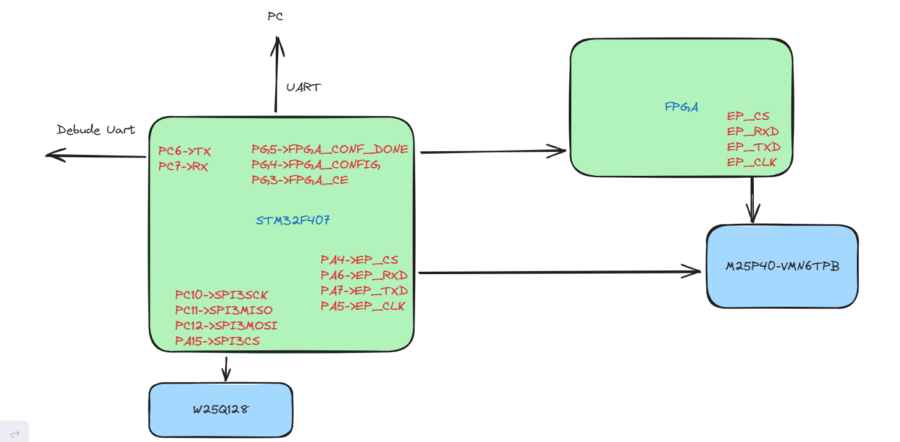

# Online_upgrade

#### 介绍
pc端对MCU和FPGA的在线升级

#### 软件架构
bootload(c)——app(c)——pc(c#)

#### 开发记录

boot：
    参考https://github.com/GlideLeo/STM32-RTThread-BootLoader?tab=readme-ov-file 增加需要的fal_cfg.h中的分区

app：
    根据自己的需求设计主要是接收上位机的ymodem协议传输过来的rbl文件并保存到fm_aream分区，实现重启

pc：
    上位机通过识别文件类型：rbf是fpga文件，rbl是mcu文件 告诉mcu的开始传输命令不同

#### 使用说明

mcu升级
1.  app生成bin文件
2.  使用ota打包文件打包 分区一定要是app 固件版本必须和上次的不一样  生成rbl文件
3.  通过upgrade上位机软件选择rbl进行升级

fpga升级
1.  quaratus生成rbf文件
2.  通过upgrade上位机软件选择rbf文件进行升级
